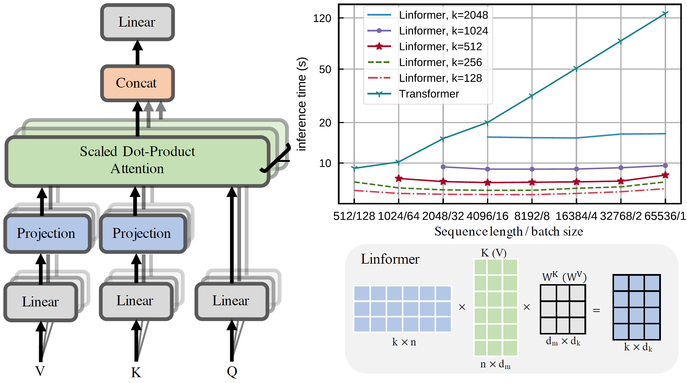

- [Vision Language Models](#vision-language-models)
  - [Vision-Language Pretraining](#vision-language-pretraining)
    - [ViLBERT: Pretraining Task-Agnostic Visiolinguistic Representations for Vision-and-Language Tasks [NeurIPS 2019]](#vilbert-pretraining-task-agnostic-visiolinguistic-representations-for-vision-and-language-tasks-neurips-2019)
    - [LXMERT: Learning Cross-Modality Encoder Representations from Transformers [EMNLP 2019]](#lxmert-learning-cross-modality-encoder-representations-from-transformers-emnlp-2019)
    - [VisualBERT: A Simple and Performant Baseline for Vision and Language [arXiv 2019/08, ACL 2020]](#visualbert-a-simple-and-performant-baseline-for-vision-and-language-arxiv-201908-acl-2020)
    - [VL-BERT: Pre-training of Generic Visual-Linguistic Representations [ICLR 2020]](#vl-bert-pre-training-of-generic-visual-linguistic-representations-iclr-2020)
    - [Unicoder-VL: A Universal Encoder for Vision and Language by Cross-modal Pre-training [AAAI 2020]](#unicoder-vl-a-universal-encoder-for-vision-and-language-by-cross-modal-pre-training-aaai-2020)
    - [Unified Vision-Language Pre-Training for Image Captioning and VQA [AAAI 2020]](#unified-vision-language-pre-training-for-image-captioning-and-vqa-aaai-2020)
    - [UNITER: Learning Universal Image-text Representations [ECCV 2020]](#uniter-learning-universal-image-text-representations-eccv-2020)
    - [Oscar: Object-Semantics Aligned Pre-training for Vision-Language Tasks [arXiv 2020/04, ECCV 2020]](#oscar-object-semantics-aligned-pre-training-for-vision-language-tasks-arxiv-202004-eccv-2020)
    - [Learning Transferable Visual Models From Natural Language Supervision [OpenAI papers 2021/01]](#learning-transferable-visual-models-from-natural-language-supervision-openai-papers-202101)
  - [Video-Language Pretraining](#video-language-pretraining)
    - [VideoBERT: A Joint Model for Video and Language Representation Learning [ICCV 2019]](#videobert-a-joint-model-for-video-and-language-representation-learning-iccv-2019)
    - [Multi-modal Transformer for Video Retrieval [ECCV 2020]](#multi-modal-transformer-for-video-retrieval-eccv-2020)
    - [HERO: Hierarchical Encoder for Video+Language Omni-representation Pre-training [EMNLP 2020]](#hero-hierarchical-encoder-for-videolanguage-omni-representation-pre-training-emnlp-2020)
    - [UniVL: A Unified Video and Language Pre-Training Model for Multimodal Understanding and Generation](#univl-a-unified-video-and-language-pre-training-model-for-multimodal-understanding-and-generation)
  - [Image-Text Retrieval & Matching](#image-text-retrieval--matching)
    - [ImageBERT: Cross-Modal Pre-training with Large-scale Weak-supervised Image-text Data](#imagebert-cross-modal-pre-training-with-large-scale-weak-supervised-image-text-data)
    - [Cross-Probe BERT for Efficient AND effective Cross-Modal Search](#cross-probe-bert-for-efficient-and-effective-cross-modal-search)
    - [Multi-Modality Cross Attention Network for Image and Sentence Matching [ICCV 2020]](#multi-modality-cross-attention-network-for-image-and-sentence-matching-iccv-2020)
  - [Analysis](#analysis)
    - [12-in-1: Multi-Task Vision and Language Representation Learning [CVPR 2020]](#12-in-1-multi-task-vision-and-language-representation-learning-cvpr-2020)
    - [Are we pretraining it right? Digging deeper into visio-linguistic pretraining](#are-we-pretraining-it-right-digging-deeper-into-visio-linguistic-pretraining)
    - [Behind the Scene: Revealing the Secrets of Pre-trained Vision-and-Language Models](#behind-the-scene-revealing-the-secrets-of-pre-trained-vision-and-language-models)
    - [Adaptive Transformers for Learning Multimodal Representations [ACL 2020]](#adaptive-transformers-for-learning-multimodal-representations-acl-2020)
  - [Survey](#survey)
    - [Pre-trained Models for Natural Language Processing: A Survey [arXiv 2020/03]](#pre-trained-models-for-natural-language-processing-a-survey-arxiv-202003)
    - [A Survey on Contextual Embeddings [arXiv 2020/03]](#a-survey-on-contextual-embeddings-arxiv-202003)
    - [Trends in Integration of Vision and Language Research: A Survey of Tasks, Datasets, and Methods [arXiv 2019]](#trends-in-integration-of-vision-and-language-research-a-survey-of-tasks-datasets-and-methods-arxiv-2019)
    - [Deep Multimodal Representation Learning: A Survey [arXiv 2019]](#deep-multimodal-representation-learning-a-survey-arxiv-2019)
    - [Pre-trained models for natural language processing: A survey [arXiv 2020]](#pre-trained-models-for-natural-language-processing-a-survey-arxiv-2020)
    - [A Survey on Visual Transformer [arXiv 2020/12]](#a-survey-on-visual-transformer-arxiv-202012)
  - [Platforms](#platforms)
    - [facebook MMF](#facebook-mmf)
- [Transformer](#transformer)
  - [Efficient Transformers](#efficient-transformers)
    - [Performer: Rethinking Attention with Performers [arXiv 2020/09, Under review of ICLR 2021]](#performer-rethinking-attention-with-performers-arxiv-202009-under-review-of-iclr-2021)
    - [Linformer: Self-Attention with Linear Complexity [arXiv 2020/06]](#linformer-self-attention-with-linear-complexity-arxiv-202006)
    - [Linear Transformer: Transformers are RNNs: Fast Autoregressive Transformers with Linear Attention [ICML 2020]](#linear-transformer-transformers-are-rnns-fast-autoregressive-transformers-with-linear-attention-icml-2020)
    - [Synthesizer: Neural Speech Synthesis with Transformer Network [AAAI 2019]](#synthesizer-neural-speech-synthesis-with-transformer-network-aaai-2019)
    - [Sinkhorn Transformer: Sparse Sinkhorn Attention [ICML 2020]](#sinkhorn-transformer-sparse-sinkhorn-attention-icml-2020)
    - [Reformer: The Efficient Transformer [ICLR 2020]](#reformer-the-efficient-transformer-iclr-2020)
    - [Transformer-XL: Attentive Language Models Beyond a Fixed-Length Context [arXiv 2019/06]](#transformer-xl-attentive-language-models-beyond-a-fixed-length-context-arxiv-201906)
    - [Compressive Transformers for Long-Range Sequence Modelling [ICLR 2020]](#compressive-transformers-for-long-range-sequence-modelling-iclr-2020)
    - [Set Transformer: A Framework for Attention-based Permutation-Invariant Neural Networks [ICML 2019]](#set-transformer-a-framework-for-attention-based-permutation-invariant-neural-networks-icml-2019)
    - [Longformer: The Long-Document Transformer [arXiv 2020/04]](#longformer-the-long-document-transformer-arxiv-202004)
    - [Routing Transformer: Efficient Content-Based Sparse Attention with Routing Transformers [arXiv 2020/10]](#routing-transformer-efficient-content-based-sparse-attention-with-routing-transformers-arxiv-202010)
    - [Big Bird: Transformers for Longer Sequences [NIPS 2020]](#big-bird-transformers-for-longer-sequences-nips-2020)
    - [Etc: Encoding long and structured data in transformers [EMNLP 2020]](#etc-encoding-long-and-structured-data-in-transformers-emnlp-2020)
    - [Memory Compressed: Generating Wikipedia by Summarizing Long Sequences [ICLR 2018]](#memory-compressed-generating-wikipedia-by-summarizing-long-sequences-iclr-2018)
    - [Blockwise Transformer: Blockwise Self-Attention for Long Document Understanding [arXiv 2020/10]](#blockwise-transformer-blockwise-self-attention-for-long-document-understanding-arxiv-202010)
    - [Image Transformer [ICML 2018]](#image-transformer-icml-2018)
    - [Sparse Transformer: Generating Long Sequences with Sparse Transformers [arXiv 2019/04]](#sparse-transformer-generating-long-sequences-with-sparse-transformers-arxiv-201904)
    - [Axial Transformer: Axial Attention in Multidimensional Transformers [arXiv 2019/12]](#axial-transformer-axial-attention-in-multidimensional-transformers-arxiv-201912)
  - [Image Transformers](#image-transformers)
    - [ViT: An Image is Worth 16x16 Words: Transformers for Image Recognition at Scale [Under review of ICLR 2021]](#vit-an-image-is-worth-16x16-words-transformers-for-image-recognition-at-scale-under-review-of-iclr-2021)
  - [Transformer Visualizations](#transformer-visualizations)
    - [Transformer Interpretability Beyond Attention Visualization [Arxiv 2020/12]](#transformer-interpretability-beyond-attention-visualization-arxiv-202012)
  - [Survey](#survey-1)
    - [Pre-trained Models for Natural Language Processing: A Survey](#pre-trained-models-for-natural-language-processing-a-survey)
    - [A Survey on Contextual Embeddings](#a-survey-on-contextual-embeddings)
    - [Trends in Integration of Vision and Language Research: A Survey of Tasks, Datasets, and Methods](#trends-in-integration-of-vision-and-language-research-a-survey-of-tasks-datasets-and-methods)
    - [Deep Multimodal Representation Learning: A Survey](#deep-multimodal-representation-learning-a-survey)
    - [Multimodal Machine Learning: A Survey and Taxonomy](#multimodal-machine-learning-a-survey-and-taxonomy)

## Vision Language Models

### Vision-Language Pretraining

####  ViLBERT: Pretraining Task-Agnostic Visiolinguistic Representations for Vision-and-Language Tasks [NeurIPS 2019]

[[paper]](https://arxiv.org/abs/1908.02265) [[code]](https://github.com/jiasenlu/vilbert_beta) *Facebook AI Research*

   - Architecture: Two stream :arrows_clockwise: **co-attentional transformer layers**
     
   - Pretrain dataset: Conceptual Captions (~3.3M)
   - Pretrain Tasks
     
     - predicting the semantics of masked words and image regions given the unmasked inputs (Masked Multi-modal Modelling)
       
       **image**: Predict the semantic classes distribution using image  input/output with detection model, then minimize KL divergence between these two distributions.
       
       **text**: Same as BERT.
     - predicting whether an image and text segment correspond (Multi-modal Alignment) **with [IMG] and [CLS] output**
   - Image feature (Fast R-CNN)
     - \<image coordinates (4), area fraction, visual feature\> from pretrained object detection network
     - projected to match the visual feature
   - Text feature
      Google's WordPiece tokenizer

#### LXMERT: Learning Cross-Modality Encoder Representations from Transformers [EMNLP 2019]

[[paper]](https://arxiv.org/abs/1908.07490) [[code]](https://github.com/airsplay/lxmert) *The University of North Carolina*

   - Architecture: Two stream --- Object relationship encoder (**Image**), language encoder (**Text**), cross-modality encoder.
     
   - Pretrain dataset: COCO + Visual Genome (9.18 M)
   - Pretrain Tasks
     
     - MLM, Masked Object Prediction (MOP) [**feature regression** and **label classification**], Cross-modality Matching **with only [CLS] output**, Image Question Answering
   - Image feature (Fast R-CNN)
     - \<bounding box coordinates, 2048-d region-of-interest\>
     - projection

       
   - Text feature

     

####  VisualBERT: A Simple and Performant Baseline for Vision and Language [arXiv 2019/08, ACL 2020]

[[paper]](https://arxiv.org/abs/1908.03557)  [[code]](https://github.com/uclanlp/visualbert)

   - Architecture: Single stream BERT
     
   - Pretrain dataset: COCO (100k)
   - Pretrain tasks:
     - Task-Agnostic Pretraining
       - MLM with only text masked
       - Sentence-image matching (Cross-modality Matching) **with only [CLS] output**
     - Task-Specific Pretraining
       using MLM with task-specific dataset, which help adapting to the new target domain.
   - Features
     - Image feature (Fast R-CNN)
       visual feature representation: bounding region feature + segment embedding + position embedding
     - Text feature: same as BERT

#### VL-BERT: Pre-training of Generic Visual-Linguistic Representations [ICLR 2020]

[[paper]](https://arxiv.org/abs/1908.08530) [[code]](https://github.com/jackroos/VL-BERT) *USTC & MSRA*

   - Architecture: Single stream BERT
     

   - Pretrain dataset: Conceptual Captions (3.3M) for visual-linguistic & BooksCorpus, English Wikipedia for pure text corpus

   - Pretrain Tasks

     - MLM, Masked RoI Classification with Linguistic Clues
     - They claim that **Cross-modality Matching** is of no use.

   - Features

     - Visual Feature Embedding (Fast R-CNN)
       - visual appearance embedding: 2048-d feature
         For **Non-visual elements**, they're obtained by RoI covering the whole input image.
       - visual geometry embedding: <!-- $(\frac{x_{LT}}{W}, \frac{y_{LT}}{H}, \frac{x_{RB}}{W}, \frac{y_{RB}}{H})$ -->  to 2048-d representation by computing sine and cosine of different wavelengths according to "Relation networks for object detection"

     - Token Embedding
       - WordPiece Embedding
         For **Visual elements**, a special [IMG] is assigned.
     - Segment Embedding: Learnable
     - Sequence Position Embedding: Learnable

#### Unicoder-VL: A Universal Encoder for Vision and Language by Cross-modal Pre-training [AAAI 2020]

[[paper]](https://arxiv.org/abs/1908.06066)

   - Architecture: Single stream BERT
     

   - Pretrain dataset: Conceptual Captions (3M) + SUB Captions (0.8M)

   - Pretrain tasks

     MLM + Masked Object Classification+ Visual-linguistic Matching (Cross-modality Matching) **with only [CLS] output**

   - Features
     - Image feature (Fast R-CNN)
       - [IMG] token + segment embedding + position embedding + next term
       - <!-- $(\frac{x_1}{W}, \frac{y_1}{H}, \frac{x_2}{W}, \frac{y_2}{H}, \frac{(y_2-y_1)(x_2-x_1)}{W\cdot H})$ --> , visual feature --separately--> embedding space using FC, then added up
     - Text feature: same as BERT

#### Unified Vision-Language Pre-Training for Image Captioning and VQA [AAAI 2020]

[[code]](https://github.com/LuoweiZhou/VLP), (**VLP**)

#### UNITER: Learning Universal Image-text Representations [ECCV 2020]

[[paper]](https://arxiv.org/abs/1909.11740) [[code]](https://github.com/ChenRocks/UNITER)

#### Oscar: Object-Semantics Aligned Pre-training for Vision-Language Tasks [arXiv 2020/04, ECCV 2020]

[[paper]](https://arxiv.org/pdf/2004.06165.pdf) [[code]](https://github.com/microsoft/Oscar)

#### Learning Transferable Visual Models From Natural Language Supervision [OpenAI papers 2021/01]

[[paper]](https://cdn.openai.com/papers/Learning_Transferable_Visual_Models_From_Natural_Language.pdf) [[blog]](https://openai.com/blog/clip/) [[code]](https://github.com/openai/CLIP)

---

### Video-Language Pretraining

#### VideoBERT: A Joint Model for Video and Language Representation Learning [ICCV 2019]

[[paper]](https://openaccess.thecvf.com/content_ICCV_2019/papers/Sun_VideoBERT_A_Joint_Model_for_Video_and_Language_Representation_Learning_ICCV_2019_paper.pdf)

#### Multi-modal Transformer for Video Retrieval [ECCV 2020]

[[paper]](https://arxiv.org/abs/2007.10639) [[code]](https://github.com/gabeur/mmt)

#### HERO: Hierarchical Encoder for Video+Language Omni-representation Pre-training [EMNLP 2020]

[[paper]](https://www.aclweb.org/anthology/2020.emnlp-main.161.pdf) [[code]](https://github.com/linjieli222/HERO)

#### UniVL: A Unified Video and Language Pre-Training Model for Multimodal Understanding and Generation 

[[paper]](https://arxiv.org/abs/2002.06353)

---

### Image-Text Retrieval & Matching

#### ImageBERT: Cross-Modal Pre-training with Large-scale Weak-supervised Image-text Data

arXiv 2020/01 [[paper]](https://arxiv.org/abs/2001.07966)

#### Cross-Probe BERT for Efficient AND effective Cross-Modal Search

ICLR 2021 submission. [[paper]](https://openreview.net/forum?id=bW9SYKHcZiz)

#### Multi-Modality Cross Attention Network for Image and Sentence Matching [ICCV 2020]

[[paper]](http://openaccess.thecvf.com/content_CVPR_2020/html/Wei_Multi-Modality_Cross_Attention_Network_for_Image_and_Sentence_Matching_CVPR_2020_paper.html)

---

### Analysis

#### 12-in-1: Multi-Task Vision and Language Representation Learning [CVPR 2020]

[[paper]](https://arxiv.org/abs/1912.02315) [[code]](https://github.com/facebookresearch/vilbert-multi-task) Multi-task Learning

#### Are we pretraining it right? Digging deeper into visio-linguistic pretraining

arXiv 2020/04 [[paper]](https://arxiv.org/abs/2004.08744) In-depth Analysis

#### Behind the Scene: Revealing the Secrets of Pre-trained Vision-and-Language Models 
arXiv 2020/05, ECCV 2020 Spotlight [[paper]](https://arxiv.org/abs/2005.07310) In-depth Analysis

#### Adaptive Transformers for Learning Multimodal Representations [ACL 2020]

[[paper]](https://arxiv.org/abs/2005.07486) Adaptive Transformer Analysis

---

### Survey

#### Pre-trained Models for Natural Language Processing: A Survey [arXiv 2020/03]

[[paper]](https://arxiv.org/abs/2003.08271)

#### A Survey on Contextual Embeddings [arXiv 2020/03]

[[paper]](https://arxiv.org/abs/2003.07278)

#### Trends in Integration of Vision and Language Research: A Survey of Tasks, Datasets, and Methods [arXiv 2019]

[[paper]](https://arxiv.org/abs/1907.09358)

#### Deep Multimodal Representation Learning: A Survey [arXiv 2019]

[[paper]](https://ieeexplore.ieee.org/abstract/document/8715409)

#### Pre-trained models for natural language processing: A survey [arXiv 2020]

[[paper]](https://arxiv.org/abs/2003.08271)

#### A Survey on Visual Transformer [arXiv 2020/12]

[[paper]](https://arxiv.org/abs/2012.12556)

---

### Platforms

#### facebook MMF 

https://github.com/facebookresearch/mmf

## Transformer

### Efficient Transformers

1. Fixed Patterns
   
   [Image Transformer [ICML 2018]](#image-transformer-icml-2018)
   - Blockwise Patterns
   - Strided Patterns
   - Compressed Patterns
2. Combination of Patterns

    Combining two or more distinct access patterns. 
3. Learnable Patterns

    [Reformer: The Efficient Transformer [ICLR 2020]](#reformer-the-efficient-transformer-iclr-2020)

    Opposite to the Fixed Patterns, learnable patterns aim to learn the access pattern in a data-driven fashion.
4. Memory

    [Longformer: The Long-Document Transformer [arXiv 2020/04]](#longformer-the-long-document-transformer-arxiv-202004)

    Leverage a side memory module to access multiple tokens at once.
5. Low-Rank Methods 

    [Linformer: Self-Attention with Linear Complexity [arXiv 2020/06]](#linformer-self-attention-with-linear-complexity-arxiv-202006)

    Leverage low-rank approximations of the self-attention matrix.
6. Kernels

    <!-- [Performer: Rethinking Attention with Performers [arXiv 2020/09, Under review of ICLR 2021]](#performer-rethinking-attention-with-performers-arxiv-202009-under-review-of-iclr-2021) -->
   
    View the attention mechanism through kernelization, which enable clever mathematical re-writing of self-attention mechanism to avoid explicitly computing the N*N matrix. Can be view as low-rank method.
7. Recurrence

   A natural extension to the blockwise method is to connect these blocks via recurrence.

   

#### Performer: Rethinking Attention with Performers [arXiv 2020/09, Under review of ICLR 2021]

[[paper]](https://arxiv.org/abs/2009.14794)  [[code]](https://github.com/lucidrains/performer-pytorch) *Google & University of Cambridge & DeepMind & Alan Turing Institute*

#### Linformer: Self-Attention with Linear Complexity [arXiv 2020/06]

[[paper]](https://arxiv.org/pdf/2006.04768.pdf)  [[code]](https://github.com/tatp22/linformer-pytorch) *FAIR* 

- Tasks: Natural language understanding and downstream tasks.
- Contribution: Projecting (N, d) Key and Value to (k, d).
- Complexity: O(n)
- Restrictions:
  - Cause mixing of sequence information, which would make it non-trivial to maintain causal masking or prevent past-future information mixing.

#### Linear Transformer: Transformers are RNNs: Fast Autoregressive Transformers with Linear Attention [ICML 2020]

[[paper]](https://arxiv.org/abs/2006.16236)  [[code]](https://github.com/lucidrains/linear-attention-transformer) *Idiap Research Institute*

#### Synthesizer: Neural Speech Synthesis with Transformer Network [AAAI 2019]

[[paper]](https://arxiv.org/abs/1809.08895)  [[code]](https://github.com/soobinseo/Transformer-TTS) *UESTC, MSRA*

#### Sinkhorn Transformer: Sparse Sinkhorn Attention [ICML 2020]

[[paper]](https://arxiv.org/abs/2002.11296)  [[code]](https://github.com/lucidrains/sinkhorn-transformer) *Google AI*

#### Reformer: The Efficient Transformer [ICLR 2020]

[[paper]](https://openreview.net/pdf?id=rkgNKkHtvB)  [[code]](https://github.com/lucidrains/reformer-pytorch) *UCB & Google Research*

- Tasks: Machine translation
- Contribution:
  - Locality Sensitive Hashing Attention (LSHA)
    - Weight approximation

      For each query <!-- $q_i$ --> , the attention is computed as: <!-- $softmax(\frac{q_i \cdot K^T}{\sqrt{d_k}}) \cdot V$ --> . 
      
      As softmax: <!-- $softmax(x)_i = \frac {e^{x_i}}{\sum _j e^{x_j}}$ --> , the several largest term can roughly approximate the value.

      \[10, 7, 1, 0 ,2\] ---softmax---> [95%, 4.7%, 0.012%, 0.0043%, 0.032%]
    - Shared-QK Transformer

      For each k, q, let <!-- $k_i=q_i=\frac{q_i}{||q_i||}$ --> 

      > Does not affect transformer performance.

    - LSH bucket

      Split queries and keys into different buckets. Each query only attend to keys in the same bucket.

- Complexity: ref to the Table 3 of paper.

#### Transformer-XL: Attentive Language Models Beyond a Fixed-Length Context [arXiv 2019/06]

[[paper]](http://arxiv.org/abs/1901.02860) [[code]](https://github.com/kimiyoung/transformer-xl) *CMU, Google Brain*

#### Compressive Transformers for Long-Range Sequence Modelling [ICLR 2020]

[[paper]](https://openreview.net/forum?id=SylKikSYDH)  [[code]](https://github.com/lucidrains/compressive-transformer-pytorch) *Deep Mind, UCL*

#### Set Transformer: A Framework for Attention-based Permutation-Invariant Neural Networks [ICML 2019]

[[paper]](http://proceedings.mlr.press/v97/lee19d.html)  *University of Oxford*

#### Longformer: The Long-Document Transformer [arXiv 2020/04]

[[paper]](https://arxiv.org/abs/2004.05150) [[code]](https://github.com/allenai/longformer) *Allen Institute for Artificial Intelligence*

- Tasks: Language Model, such as summarization, question answering...
- Contribution:
  - Sliding windows attention

    Applying different w for different layer. They increase the receptive field as the model goes deeper.
  - Dilated sliding window

    In multi-head attention, they use mixed sliding windows. The dilated sliding is used to focus on the longer context, while un-dilated sliding is used to focus on local context.
  - Global+sliding window

    They add global attention in some specific points for different tasks. \[CLS\] for classification task, "Whole Question Sentence" for QA task.
- Complexity: O(kn) for Local Attention, where k is the window size.

#### Routing Transformer: Efficient Content-Based Sparse Attention with Routing Transformers [arXiv 2020/10]

[[paper]](https://arxiv.org/pdf/2003.05997.pdf)  [[code]](https://github.com/lucidrains/routing-transformer) *Google Research*

#### Big Bird: Transformers for Longer Sequences [NIPS 2020]

[[paper]](https://proceedings.neurips.cc//paper/2020/file/c8512d142a2d849725f31a9a7a361ab9-Paper.pdf)  *Google Research*

#### Etc: Encoding long and structured data in transformers [EMNLP 2020]

[[paper]](https://arxiv.org/pdf/2004.08483.pdf)  [[code]](https://github.com/google-research/google-research/tree/master/etcmodel) Google Research

#### Memory Compressed: Generating Wikipedia by Summarizing Long Sequences [ICLR 2018]

[[paper]](https://arxiv.org/abs/1801.10198) [[code]](https://github.com/lucidrains/memory-compressed-attention) ** *Google Brain*

- Tasks: Text generation with WIKI as input.
- Contribution:
  - Local Attention
  - Memory-compressed Attention
- Complexity: O(bn) for Local Attention, where b is the block number. O(n*n/k) for Memory-compressed Attention, where k is the `nn.Conv1d` kernel size and strides.

#### Blockwise Transformer: Blockwise Self-Attention for Long Document Understanding [arXiv 2020/10]

[[paper]](https://arxiv.org/abs/1911.02972)  [[code]](https://github.com/xptree/BlockBERT) *Tsinghua University, FAIR*

#### Image Transformer [ICML 2018]

[[paper]](https://arxiv.org/abs/1802.05751)  [[code1]](https://github.com/sahajgarg/image_transformer) [[code2]](https://github.com/tensorflow/tensor2tensor/) *Google Brain, UCB, Google AI*

- Tasks: Image Generation and Super Resolution
- Contribution:
  - Query Block split & 2 Local Attention
- Complexity: O(nm), where n is the length of flatted image, m is the memory length.
- Restrictions
  - Only focus on local neighborhood, which can be a issue where global information is required to solve a task.
  - The constant term: <!-- $O(l_q^2 \cdot nm)$ --> , <!-- $l_q$ -->  is introduced to be a extra hyper-parameter.

#### Sparse Transformer: Generating Long Sequences with Sparse Transformers [arXiv 2019/04]

[[paper]](https://arxiv.org/abs/1904.10509)  [[code]](https://github.com/openai/sparse_attention) *OpenAI*

#### Axial Transformer: Axial Attention in Multidimensional Transformers [arXiv 2019/12]

[[paper]](https://arxiv.org/abs/1912.12180) [[code]](https://github.com/lucidrains/axial-attention) *UCB, Google Brain*

---

### Image Transformers

#### ViT: An Image is Worth 16x16 Words: Transformers for Image Recognition at Scale [Under review of ICLR 2021]

[[paper]](https://arxiv.org/abs/2010.11929)  [[code1]](https://github.com/google-research/vision_transformer) [[code2]](https://github.com/lucidrains/vit-pytorch) *Google*

---

### Transformer Visualizations

#### Transformer Interpretability Beyond Attention Visualization [Arxiv 2020/12]

[[paper]](https://arxiv.org/abs/2012.09838)  [[code]](https://github.com/hila-chefer/Transformer-Explainability) *FAIR*

---

### Survey

#### Pre-trained Models for Natural Language Processing: A Survey

arXiv 2020/03 [[paper]](https://arxiv.org/abs/2003.08271)

#### A Survey on Contextual Embeddings

arXiv 2020/03 [[paper]](https://arxiv.org/abs/2003.07278)

#### Trends in Integration of Vision and Language Research: A Survey of Tasks, Datasets, and Methods

arXiv 2019 [[paper]](https://arxiv.org/abs/1907.09358)

#### Deep Multimodal Representation Learning: A Survey

arXiv 2019 [[paper]](https://ieeexplore.ieee.org/abstract/document/8715409)

#### Multimodal Machine Learning: A Survey and Taxonomy

TPAMI 2018 [[paper]](https://arxiv.org/abs/1705.09406)

